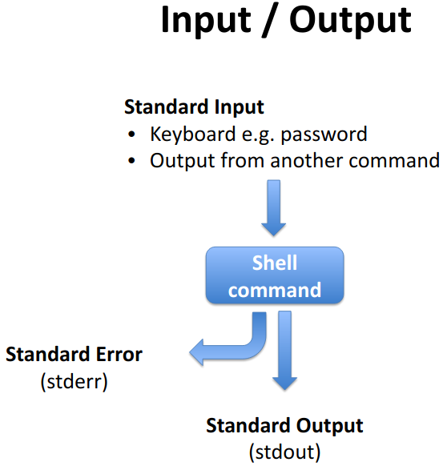

<h2 align="center"> Basics of Bash scripting </h2>

<h2 align="left"> Navigating Files and Directories </h2>

```bash

pwd
cd /
cd ~
cd ..
cd ../..
cd .
cd /users/nelle/Desktop/data-shell
ls

```

<hr>

<h2 align="left"> My directory structure</h2>

```bash
## Install the tree command
sudo apt-get install tree  
## Run the command to visualize the directory structure of your machine
tree
```

<p align="center"><a href="#"></a></p>


<h2 align="left">More details about your files</h2>
<p align="center"><a href="#"></a></p>


<h2 align="left">Make your life easier</h2>
<p align="center"><a href="#"></a></p>


<h2 align="center">Working With Files and Directories</h2>

```bash
mkdir thesis lectures
#Write text, save by CTRL-O 
nano draft.txt

mv lectures manuscript
mv manuscript thesis/. 
mv draft.txt final.txt
mv final.txt thesis/.
mv thesis/final.txt draft.txt

cp draft.txt thesis/
cp draft.txt thesis/2ndCopy.txt

rm thesis
rm -r thesis
rm draft.txt
```

<hr>

<p align="center"><a href="#"></a></p>

<hr>

<h2 align="center">Pipes and Filters</h2>

```bash
cd molecules
wc *.pdb
wc -l *.pdb > lengths.txt
cat lengths.txt
sort -n lengths.txt
sort -n lengths.txt > sorted-lengths.txt
head -n 1 sorted-lengths.txt
sort -n lengths.txt | head -n 1
wc -l *.pdb | sort -n | head -n 1
cd ../
wc -l notes.txt
wc -l < notes.txt
```
<b><h3>What is the different?</h3></b>

```bash
echo hello > testfile01.txt
echo hello >> testfile02.txt
```

<b><h3>Run the same line again. What is different?</h3></b>

```bash
uniq data/salmon.txt
sort data/salmon.txt | uniq
```

<b><h3>What is the different?</h3></b>


```bash
uniq -c data/salmon.txt
sort data/salmon.txt | uniq -c
```

<b><h3>What is the different?</h3></b>

<h3>Select fields</h3>

`cut -d , -f 2 data/animals.txt`


<h3>Concatenate lines</h3>

`cat data/salmon.txt | paste - -`

<h3>Replace delimiter</h3>

`cat data/planets.txt | tr "," "\t"`

<h3>Find your text</h3>

```bash
grep The writing/haiku.txt
grep -w The writing/haiku.txt
grep -n The writing/haiku.txt
grep -n -w -i The writing/haiku.txt
grep -v -i The writing/haiku.txt
grep -v -i The writing/haiku.txt | grep "^."
```

<p align="center"><a href="#"></a></p>


