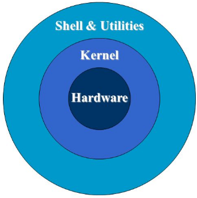

<p align="center">
  <h1 align="center">Bash Programming</h1>
  
  <hr>
  
  <h2 align="center"> Unix Components </h2>
      <p align="center"><a href="#"></a></p>
      <h3 align="center"><b>UNIX is a machine independent operating system</b></h3>
  
  <hr>
  </p>
  <h2 align="center"> Unix Philosophy </h2>


<ul>
<li><b>Make each program do one thing well. Reusable software tools: 1 tool = 1 function</b></li>
<li><b>Expect the output of every program to become the input of another, yet unknown, program to combine simple tools to perform complex tasks</b></li>
<li><b>Prototyping: get something small working as soon as possible and modify it incrementally until it is finished</b></li>
<li><b>Use terse commands and messages: reduces typing and screen output</b></li>
</ul>
  
<hr>

<h2 align="center"> Unix Kernel </h2>

<ul>
<li><b>The core of the system. Loaded at system start up.</b></li>
<li><b>Written in C language (thus machine independent)</b></li>
<li><b>Manages system resources, Example functions:</b>
  <ul>
  <li>Managing the memory and allocating it to each process.</li>
  <li>Process scheduling by CPU so that the work of each user is carried out as efficiently as possible.</li>
  <li>Data transfer from one part of the machine to another</li>
  <li>interpreting and executing instructions from the shell</li>
  <li>enforcing file access permissions</li>
  </ul>
</li>
</ul>

<hr>

<h2 align="center"> Overview of Unix shells </h2>
<ul>
<li><b>Shell script: The origin of <a href="https://en.wikipedia.org/wiki/Scripting_language">scripting languages</a></b></li>
<li><b>A shell is a program that takes commands and gives them to the operating system kernel to be executed.</b></li>
<li><b>A terminal is a program that allows us as end users to interact with the shell. </b></li>
<li><b><a href="http://swcarpentry.github.io/shell-novice/setup.html">Setup</a></b></li>
<li><b>There are many shells</b>
<ul>
<li>Bourne shell (sh) was the first major shell</li>
<li>C and TC shell (csh and tcsh): improved but less popular</li>
<li>Bourne Again shell (Bash/bash): GNU/FSF improvement of Bourne shell</li>
<li>Other Bash-like shells: Korn shell (ksh), Z shell (zsh)</li>
</ul>
</li>
<li><b>You can make your own shell ;)</b></li>
<li><b>Which shell do you have on your machine?</b></li>
</ul>

```bash

ls /bin/*sh

```

<ul>
<li><b>What is your default shell?</b></li>
</ul>

```bash

echo $SHELL

```

<ul>
<li><b>What is the version of your bash?</b></li>
</ul>

```bash

bash --version 

```

<hr>

<h2 align="center"> Why command line? </h2>

<ul>
<li><b>Use not limited to GUI design</b></li>
<li><b>GUI applications tend to be less stable</b></li>
<li><b>Glue more advanced scripts</b></li>
<li><b>Repeatability & Automation</b></li>
</ul>

<hr>

<h2 align="center"> Why learn Bash? </h2>

<ul>
<li><b>Learning Bash means learning the roots of scripting</b></li>
<li><b>Bash & sh are the most commonly used scripts on Unix</b>
  <ul><li>Note: sh is usually just a link to Bash on Unix like sys.</li></ul></li>
<li><b>Bash is open source</b></li>
</ul>

<hr>

<h2 align="center"> What should you expect today? </h2>

Today we will have a quick introduction for the basic features of bash scripting. We should learn about:

<ul>
<li><b>Working With Files and Directories from the command line. </b></li>
<li><b>Pipes and Filters. </b></li>
<li><b>Semantics of loops and the conditional statemnets. </b></li>
<li><b>integer arithmetic expressions. </b></li>
<li><b>Writing Shell Scripts. </b></li>
</ul>

<hr>


 

