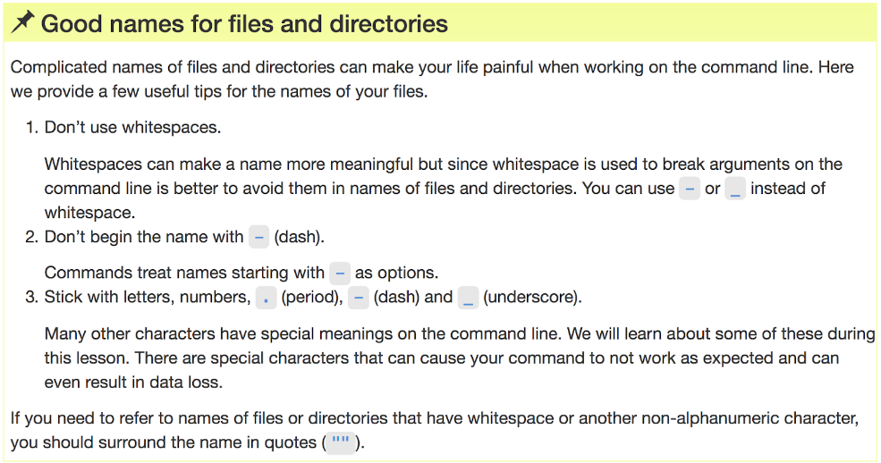
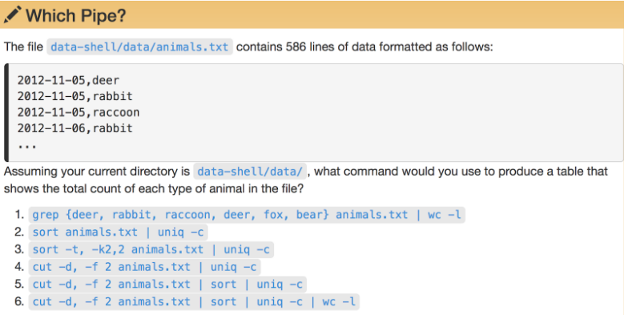
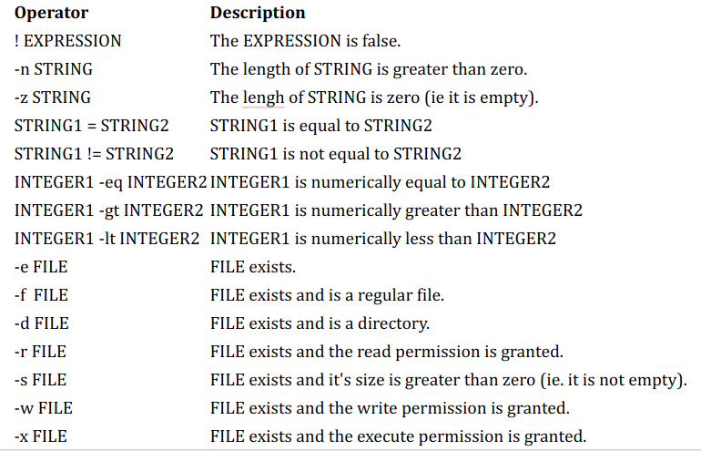

<h2 align="center">My directory structure</h2>

<p align="center"><a href="#"></a></p>


<h2 align="center">Working With Files and Directories</h2>

```bash
mkdir thesis lectures
#Write text, save by CTRL-O 
nano draft.txt

mv lectures manuscript
mv manuscript thesis/. 
mv draft.txt final.txt
mv final.txt thesis/.
mv thesis/final.txt draft.txt

cp draft.txt thesis/
cp draft.txt thesis/2ndCopy.txt

rm thesis
rm -r thesis
rm draft.txt
```

<hr>

<p align="center"><a href="#"></a></p>

<hr>

<h2 align="center">Pipes and Filters</h2>

```bash
cd molecules
wc *.pdb
wc -l *.pdb > lengths.txt
cat lengths.txt
sort -n lengths.txt
sort -n lengths.txt > sorted-lengths.txt
head -n 1 sorted-lengths.txt
sort -n lengths.txt | head -n 1
wc -l *.pdb | sort -n | head -n 1
cd ../
wc -l notes.txt
wc -l < notes.txt
```
<b><h3>What is the different?</h3></b>

```bash
echo hello > testfile01.txt
echo hello >> testfile02.txt
```

<b><h3>Run the same line again. What is different?</h3></b>

```bash
uniq data/salmon.txt
sort data/salmon.txt | uniq
```

<b><h3>What is the different?</h3></b>


```bash
uniq -c data/salmon.txt
sort data/salmon.txt | uniq -c
```

<b><h3>What is the different?</h3></b>

<h3>Select fields</h3>

`cut -d , -f 2 data/animals.txt`


<h3>Concatenate lines</h3>

`cat data/salmon.txt | paste - -`

<h3>Replace delimiter</h3>

`cat data/planets.txt | tr "," "\t"`

<h3>Find your text</h3>

```bash
grep The writing/haiku.txt
grep -w The writing/haiku.txt
grep -n The writing/haiku.txt
grep -n -w -i The writing/haiku.txt
grep -v -i The writing/haiku.txt
grep -v -i The writing/haiku.txt | grep "^."
```

<p align="center"><a href="#"></a></p>


<h2 align="center">If statement</h2>

```bash
x=500
if [ $x -gt 100 ]
then
     echo large number
else
     echo This is nothing
fi
```

```bash
if [ $x -gt 100 ];then  echo large number; else echo This is nothing; fi
```

<p align="center"><a href="#"></a></p>

<ul>
<li>
  [ and ] mean Bash test, so these are the same:
  <ul>
    <li>if [ -d /etc ]; then echo Yes; fi</li>
    <li>if test -d /etc; then echo Yes; fi</li>
  </ul>
</li>

<li>
  [[ and ]] are “enhanced” but not sh-compatible. These two mean the same:
  <ul>
    <li>if [ -d /etc -a -d /bin ] ; then echo Yes ; fi</li>
    <li>if [[ -d /etc && -d /bin ]] ; then echo Yes ; fi</li>
  </ul>
</li>

<li>[, ], [[ and ]] are tokens. Keep spaces around them</li>
</ul>

<br>

```bash
z="12"
if [ $z == 12 ] ; then echo Yes ; fi
if [[ $z == 12 ]] ; then echo Yes ; fi
if [ $z = 12 ] ; then echo Yes ; fi
if [[ $z == 012 ]] ; then echo Yes ; fi
if [ $z -eq 012 ] ; then echo Yes ; fi
if [[ $z -eq 12 ]] ; then echo Yes ; fi
if [[ $z -eq 012 ]] ; then echo Yes ; fi
```

<b><u>do not use [[ ]] in arithmetic comparisons </u></b>

```bash
empty="";
if [ -n "$empty" ] ; then echo Yes ; fi
if [[ -n "$empty" ]] ; then echo Yes ; fi
if [ -n $empty ] ; then echo Yes ; fi
if [[ -n $empty ]] ; then echo Yes ; fi
```


